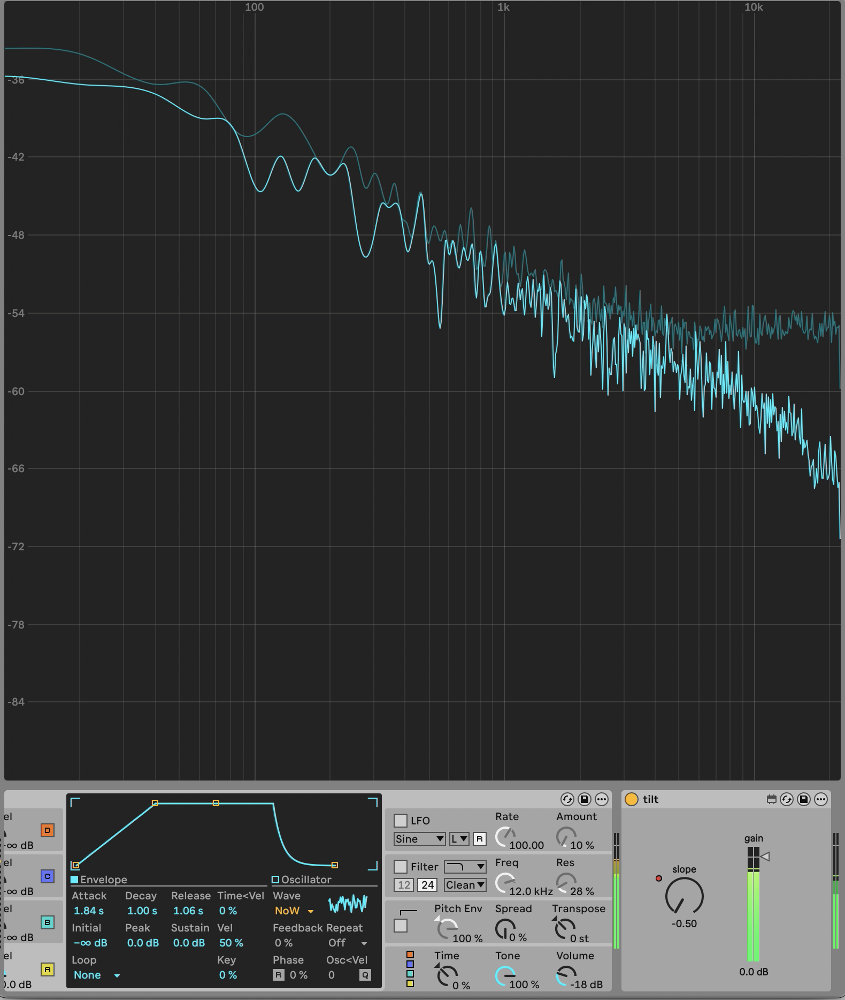

# Spectral Tilt Filter M4L Plugin
Barely works tbh but wow omg it works. A slope of -0.5 is a "pinking filter" (i.e. it turns white noise to pink noise). This is rly good for making constant-amplitude melodic instruments sound more evenly loud across a wider pitch range.

Translated from the `FAUST` implementation in [this paper](https://ccrma.stanford.edu/~jos/spectilt/spectilt.pdf)
